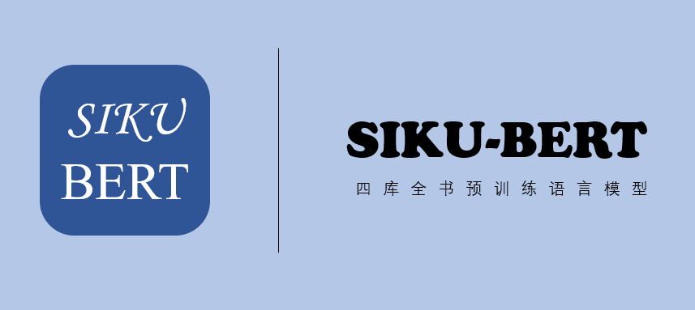

<!--
 * @Author: zihe.zhu@qq.com
 * @Date: 2021-05-08 17:05:44
 * @LastEditTime: 2021-05-08 19:17:19
-->

<p align="center">
    <br>
    
    <br>
</p>
<p align="center">
<a href="https://github.com/SIKU-BERT/SikuBERT/issues"></a>
<a href="https://github.com/SIKU-BERT/SikuBERT/stargazers"></a>
<a href="https://github.com/SIKU-BERT/SikuBERT/blob/main/LICENSE"></a>
</p>

## 引言 Introduction

数字人文研究需要大规模语料库和高性能古文自然语言处理工具支持。预训练语言模型已经在英语和现代汉语文本上极大的提升了文本挖掘的精度，目前亟需专门面向古文自动处理领域的预训练模型。

我们以校验后的高质量《四库全书》全文语料作为训练集，基于BERT深度语言模型框架，构建了面向古文智能处理任务的SikuBERT和SikuRoBERTa预训练语言模型。

我们设计了面向《左传》语料的古文自动分词、断句标点、词性标注和命名实体识别4个下游任务，验证模型性能。


* `SikuBERT`和`SikuRoBERTa`基于`《四库全书》`语料训练，《四库全书》又称《钦定四库全书》，是清代乾隆时期编修的大型丛书。实验去除了原本中的注释部分，仅纳入正文部分，参与实验的训练集共纳入字数达`536,097,588`个，数据集内的汉字均为繁体中文。

* 基于领域适应训练（Domain-Adaptive Pretraining）的思想，`SikuBERT`和`SikuRoBERTa`在BERT结构的基础上结合大量古文语料，分别继续训练BERT和RoBERTa模型，以获取面向古文自动处理领域的预训练模型。

## 新闻 News

- 2020/5/8 模型加入[Huggingface Transformers](https://github.com/huggingface/transformers)预训练模型“全家桶”。

- 2021/5/6  论文被第五届全国未来智慧图书馆发展论坛会议录用 【论文 [pdf](./appendix/面向数字人文的《四库全书》预训练模型构建及应用研究.pdf)】

## 使用方法 How to use
### Huggingface Transformers
基于[Huggingface Transformers](https://github.com/huggingface/transformers)的`from_pretrained`方法可以直接在线获取SikuBERT和SikuRoBERTa模型。


```python
from transformers import AutoTokenizer, AutoModel

tokenizer = AutoTokenizer.from_pretrained("SIKU-BERT/sikubert")

model = AutoModel.from_pretrained("SIKU-BERT/sikuroberta")
```

## 下载模型 Download PTM
- 我们提供的模型是`PyTorch`版本。

### 调用 From Huggingface
- 通过Huggingface官网直接下载：

    - **SikuBERT: https://huggingface.co/SIKU-BERT/sikubert**

    - **SikuRoBERTa: https://huggingface.co/SIKU-BERT/sikuroberta**

### 云盘 From BaiduYun


| 模型名称 | 网盘链接 |
| :-----  | :------ |
| sikubert | [链接](https://pan.baidu.com/s/1kGVzjyfDLcx4i52Vtzp_wA) 提取码: jn94 |
| sikuroberta | [链接](https://pan.baidu.com/s/1T8lQ0w6tkGDBO_F_DyrTVw) 提取码: ihgq |


## 验证与结果 Evaluation & Results
- 我们SikuBERT和SikuRoBERTa应用在语源为繁体中文的《左传》语料上进行古文自动分词、词性标注、断句和实体识别实验。实验结果如下。

| 任务名   task type  | 预训练模型pretrained models | 精确率（P） | 召回率（R） | 调和平均值（F1） |
|:----------:|:-----------:|:------:|:-----:|:-----:|
| 分词 Participle   | BERT-base-chinese      | 86.99% | 88.15% | 87.56%    |
|               | RoBERTa                | 80.90% | 84.77% | 82.79%    |
|               | SikuBERT               | 88.62% | 89.08% | 88.84%    |
|               | SikuRoBERTa            | 88.48% | 89.03% | **88.88%**    |
| 词性标注 POS tag     | BERT-base-chinese      | 89.51% | 90.10% | 89.73%    |
|               | RoBERTa                | 86.70% | 88.45% | 87.50%    |
|               | SikuBERT               | 89.89% | 90.41% | **90.10%**    |
|               | SikuRoBERTa            | 89.74% | 90.49% | 90.06%    |
| 断句 Segmentation| BERT-base-chinese      | 78.77% | 78.63% | 78.70%    |
|               | RoBERTa                | 66.71% | 66.38% | 66.54%    |
|               | SikuBERT               | 87.38% | 87.68% | **87.53%**    |
|               | SikuRoBERTa            | 86.81% | 87.02% | 86.91%    |


| 任务名 task type    | 预训练模型pretrained models | 实体名 entity names | 精确率（P）                 | 召回率（R）  | 调和平均值（F1） |
|:----------:|:-----------:|:------:|:-----:|:-----:|:-----:|
| 实体识别  NER  | BERT-base-chinese      | nr(人名)  | 86.66%    | 87.35% | 87.00% |
|               |                        | ns(地名)  | 83.99%    | 87.00% | 85.47% |
|               |                        | t(时间)   | 96.96%    | 95.15% | 96.05% |
|               |                        | avg/prf | 86.99%    | 88.15% | 87.56% |
|               | RoBERTa                | nr(人名)  | 79.88%    | 83.69% | 81.74% |
|               |                        | ns(地名)  | 78.86%    | 84.08% | 81.39% |
|               |                        | t(时间)   | 91.45%    | 91.79% | 91.62% |
|               |                        | avg/prf | 80.90%    | 84.77% | 82.79% |
|               | SikuBERT               | nr(人名)  | 88.65%    | 88.23% | 88.44% |
|               |                        | ns(地名)  | 85.48%    | 88.20% | 86.81% |
|               |                        | t(时间)   | 97.34%    | 95.52% | 96.42% |
|               |                        | avg/prf | 88.62%    | 89.08% | 88.84% |
|               | SikuRoBERTa            | nr(人名)  | 87.74%    | 88.23% | **87.98%** |
|               |                        | ns(地名)  | 86.55%    | 88.73% | **87.62%** |
|               |                        | t(时间)   | 97.35%    | 95.90% | **96.62%** |
|               |                        | avg/prf | 88.48%    | 89.30% | **88.88%**|


## 引用方法 Citing
- 如果我们的内容有助您研究工作，欢迎在论文中引用。

```tex
[1] 王东波,刘畅,朱子赫等.面向数字人文的《四库全书》预训练模型构建及应用研究[C]//第五届全国未来智慧图书馆发展论坛会议,武汉,2021.
```

## 免责声明 Disclaim
- 报告中所呈现的实验结果仅表明在特定数据集和超参组合下的表现，并不能代表各个模型的本质。实验结果可能因随机数种子，计算设备而发生改变。**使用者可以在许可证范围内任意使用该模型，但我们不对因使用该项目内容造成的直接或间接损失负责。**


## 致谢 Acknowledgment
- SikuBERT是基于[中文BERT预训练模型](https://huggingface.co/bert-base-chinese)继续训练。
- SikuRoBERTa是基于[中文BERT-wwm](https://github.com/ymcui/Chinese-BERT-wwm)项目中`RoBERTa-wwm-ext`继续训练的。

## 联系我们 Contact us
- Chang 649164915@qq.com
- Joe zihe.zhu@qq.com

